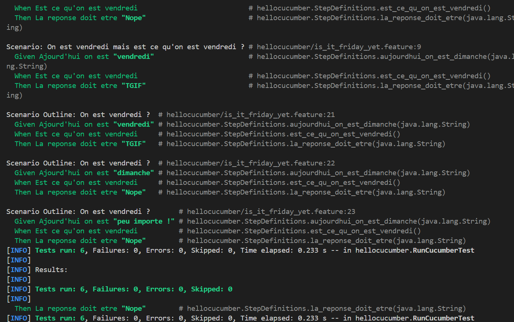
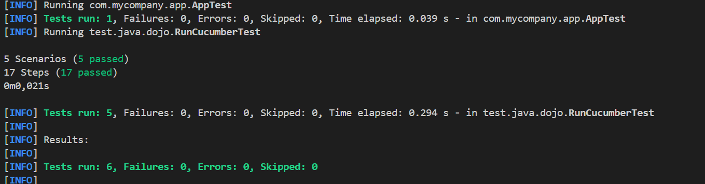
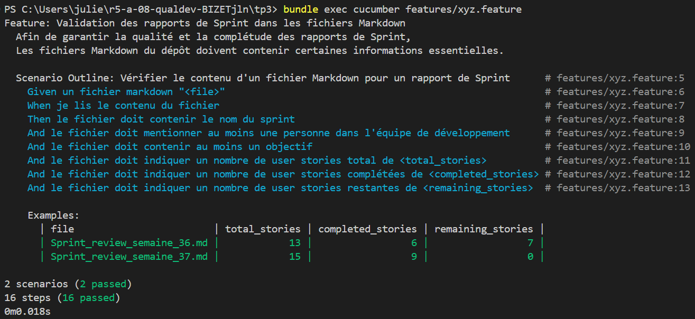

= R5.A.08 -- Dépôt pour les TPs
:icons: font
:MoSCoW: https://fr.wikipedia.org/wiki/M%C3%A9thode_MoSCoW[MoSCoW]

Ce dépôt concerne les rendus de mailto:julien.bizet@etu.univ-tlse2.fr[Julien BIZET].

== TP1

.Exemple de code
[source,java]
---
@Given("Ajourd'hui on est {string}")
    public void aujourdhui_on_est_dimanche(String actualday) {
        actualDay = actualday;
}
@When("Est ce qu'on est vendredi")
public void est_ce_qu_on_est_vendredi() {
    answer = "vendredi".equals(actualDay) ? "TGIF" : "Nope";
}
@Then("La reponse doit etre {string}")
public void la_reponse_doit_etre(String attendu) {
    if(!attendu.equals(answer)){
        throw new AssertionError("la reponse attendu est " + attendu + " mais la reponse est " + answer);
    }
}
---

.is_it_friday_yet.feature
[source,Gherkin]
---
Feature: On est vendredi?
  On est vendredi
---
  Scenario: On est dimanche mais est ce qu'on est vendredi ?
    Given Ajourd'hui on est "dimanche"
    When Est ce qu'on est vendredi
    Then La reponse doit etre "Nope"
---    
  Scenario: On est vendredi mais est ce qu'on est vendredi ?
    Given Ajourd'hui on est "vendredi"
    When Est ce qu'on est vendredi
    Then La reponse doit etre "TGIF"
---
  Scenario Outline: On est vendredi ?
    Given Ajourd'hui on est "<day>"
    When Est ce qu'on est vendredi
    Then La reponse doit etre "<answer>"
    Examples:
      | day           | answer |
      | vendredi      | TGIF   |
      | dimanche      | Nope   |
      | peu importe ! | Nope   |
---

.Resultat TP1

== TP2

.Order
[source,java]
---
package main.java.dojo;
import java.util.ArrayList;
import java.util.List;
---
public class Order {
    private String Owner;
    private String Target;
    private List<String> Cocktails;
    private String Message;
---
    public Order() {
        Cocktails = new ArrayList<>();
    }
---
    public void declareOwner(String owner) {
        Owner = owner;
    }
---
    public void declareTarget(String target) {
        Target = target;
    }
---
    public List<String> getCocktails() {
        return Cocktails;
    }
---
    public void addCocktail(String cocktail) {
        Cocktails.add(cocktail);
    }
---
    public void addMessage(String message) {
        this.Message = message;
    }
---
    public String getTicket() {
        return String.format("From %s to %s: %s", Owner, Target, Message);
    }
}
---

.Resultat TP2

== TP3

.feature
[source,Gherkin]
Feature: Validation des rapports de Sprint dans les fichiers Markdown
  Afin de garantir la qualité et la complétude des rapports de Sprint,
  Les fichiers Markdown du dépôt doivent contenir certaines informations essentielles.
---
  Scenario Outline: Vérifier le contenu d'un fichier Markdown pour un rapport de Sprint
    Given un fichier markdown "<file>"
    When je lis le contenu du fichier
    Then le fichier doit contenir le nom du sprint
    And le fichier doit mentionner au moins une personne dans l'équipe de développement
    And le fichier doit contenir au moins un objectif
    And le fichier doit indiquer un nombre de user stories total de <total_stories>
    And le fichier doit indiquer un nombre de user stories complétées de <completed_stories>
    And le fichier doit indiquer un nombre de user stories restantes de <remaining_stories>
---
    Examples:
      | file                        | total_stories | completed_stories | remaining_stories |
      | Sprint_review_semaine_36.md |            13 |                 6 |                 7 |
      | Sprint_review_semaine_37.md |            15 |                 9 |                 0 |
---

.implémentation en ruby
[source,ruby]
require 'json'
---
Given('un fichier markdown {string}') do |file|
  @file_path = File.join('features', 'markdown', file)
  raise "Le fichier #{file} est introuvable" unless File.exist?(@file_path)
end
---
When('je lis le contenu du fichier') do
  @file_content = File.read(@file_path)
end
---
Then('le fichier doit contenir le nom du sprint') do
  raise 'Nom du sprint introuvable' unless @file_content.match?(/^### 1\. Nom du Sprint/)
end
---
Then('le fichier doit mentionner au moins une personne dans l\'équipe de développement') do
  dev_team_section = @file_content.match(/^### 4\. Équipe de développement.*?((?:- \[x\].*?)+)/m)
  raise 'Aucune personne trouvée dans l\'équipe de développement' unless dev_team_section && !dev_team_section[1].strip.empty?
end
---
Then('le fichier doit contenir au moins un objectif') do
  objectives_section = @file_content.match(/^### 1\. Objectifs prévus.*?((?:- .*?)+)/m)
  raise 'Aucun objectif trouvé' unless objectives_section && !objectives_section[1].strip.empty?
end
---
Then('le fichier doit indiquer un nombre de user stories total de {int}') do |total_stories|
  raise "Nombre total de user stories incorrect (attendu: #{total_stories})" unless @file_content.match?(/^### 1\. Nombre de user story.*\n- Nombre de user story : #{total_stories}$/m)
end
---
Then('le fichier doit indiquer un nombre de user stories complétées de {int}') do |completed_stories|
  raise "Nombre de user stories complétées incorrect (attendu: #{completed_stories})" unless @file_content.match?(/^### 1\. Nombre de user story.*\n- Nombre de user story complétée pendant ce sprint : #{completed_stories}$/m)
end
---
Then('le fichier doit indiquer un nombre de user stories restantes de {int}') do |remaining_stories|
  raise "Nombre de user stories restantes incorrect (attendu: #{remaining_stories})" unless @file_content.match?(/^### 1\. Nombre de user story.*\n- Nombre de user story restante : #{remaining_stories}$/m)
end
---

.Objectif

L'objectif est de vérifier que chaque document de sprint review répond aux attentes et que les informations nécessaires y sont bien présentes.

.Resultat TP3
